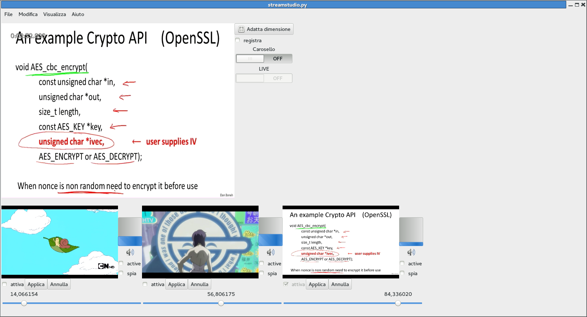

We would like to manage multiple video/audio sources and switch
through them using a GTK GUI but also from python command line.

FUNCTIONALITY
-------------

 - [x] add stream contained in media file
 - [ ] use v4l2 source
 - [ ] create stream from images (png,jpeg,gif)
 - [ ] create stream from X windows
 - [ ] remove input sources
 - [ ] add pause/play for not live sources
 - [ ] use time format in the seek bar
 - [ ] use different gui for live and not live sources
 - [x] switch between video sources
 - [ ] switch between audio sources
 - [x] visualize input audio level
 - [x] visualize input audio volume
 - [x] modify input audio volume
 - [ ] save locally input and output
 - [ ] headless mode (screencast maybe)

Quick start (with a virtualenv):

    $ git clone https://github.com/gipi/Streamstudio.git
    $ cd Streamstudio
    $ virtualenv --system-site-packages env # --system-wide-packages otherwise gobject-introspection doesn't work
    $ source env/bin/activate
    $ python setup.py develop
    $ streamstudio

Below a screenshot of the main GUI

*Not all the button are functional*

DEPENDENCIES
------------

In order to make this program runs you need

 - GObject
 - Gstreamer1.0
 - Gtk3
 - Glade

This program use the PyGOBject introspection <https://live.gnome.org/PyGObject>
in order to be able to use directly the C APIs.

If you are interested in more details about introspection look at this page

  https://wiki.gnome.org/Projects/PyGObject/IntrospectionPorting

The documentation for the PyGTK3 and GStreamer code can be found at the following pages

  https://python-gtk-3-tutorial.readthedocs.org/en/latest/index.html
  http://lazka.github.io/pgi-docs/api/Gst_1.0/

In some distributions there isn't available yet gstreamer1.0, if you want
to use this application, you can use the gstreamer-repo available to the
github repository present at the address

    https://github.com/gipi/gstreamer-repo.git

STREAMING
---------

A virtualbox machine is configured to be run with icecast and liquidsoap, it's simple as

    $ vagrant up

The first time is run an error pops out since it uses ``ansible`` that needs ``python`` installed:
you can simply do

    $ vagrant ssh -c 'sudo apt-get update'
    $ vagrant ssh -c 'sudo apt-get install python-apt'
    $ vagrant provision

TESTS
-----

There are also some (broken) tests, run them with

 $ python -m unittest tests

DEBUGGING GSTREAMER PART
------------------------

It's possible to debug internal pipelines using the

    GST_DEBUG_DUMP_DOT_DIR=$PWD
    GST_DEBUG="*:2,GST_CAPS:4"

environmental variables.

V4L2Loopback
------------

In order to test is possible to use v4l2loopback that creates
for you some fake video devices with stream of your choice.

The project is hosted at

  https://github.com/umlaeute/v4l2loopback/wiki

 # apt-get install v4l2loopback-dkms v4l2loopback-utils
